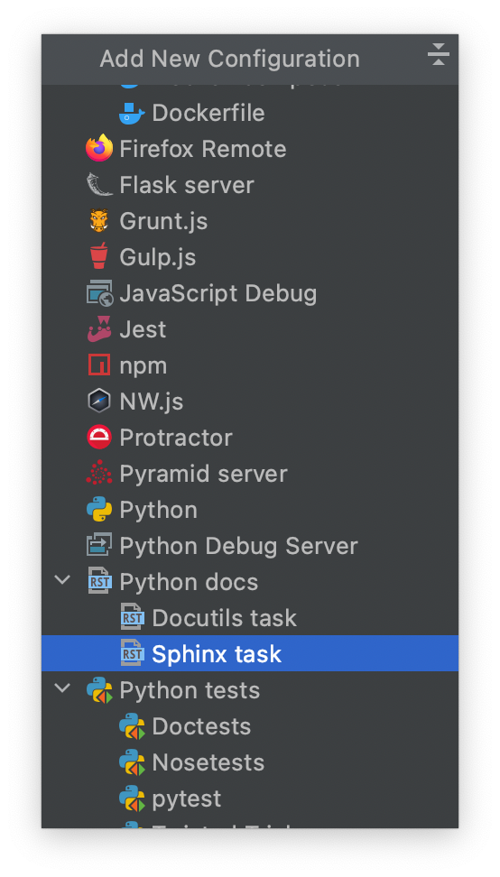
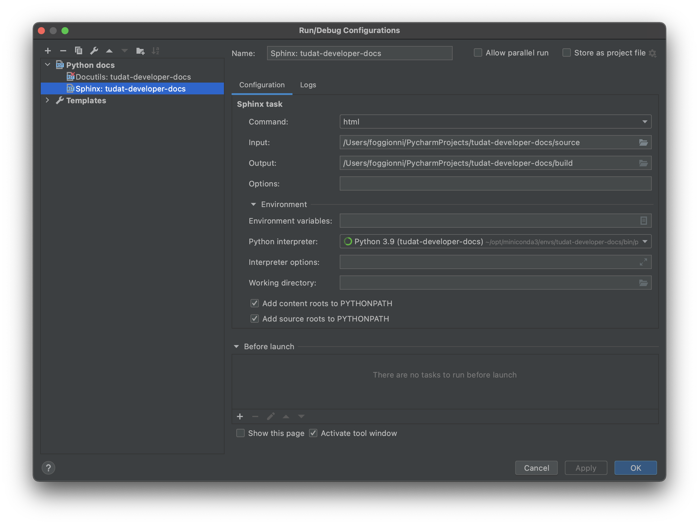
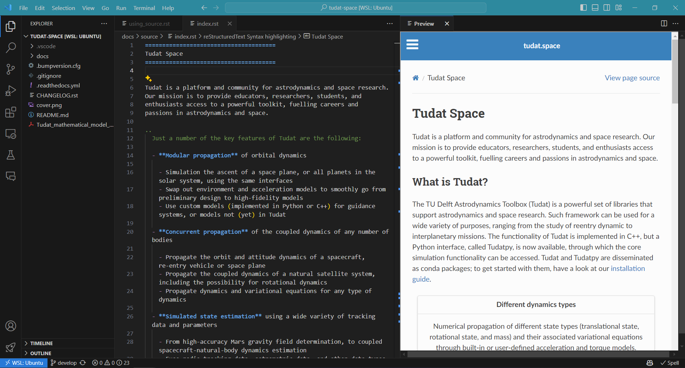
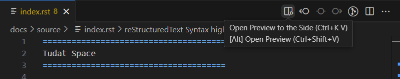

====================
Sphinx Documentation
====================

.. code-block::

    sudo apt-get install  texmaker gummi texlive texlive-full texlive-latex-recommended latexdraw intltool-debian lacheck libgtksourceview2.0-0 libgtksourceview2.0-common lmodern luatex po-debconf tex-common texlive-binaries texlive-extra-utils texlive-latex-base texlive-latex-base-doc texlive-luatex texlive-xetex texlive-lang-cyrillic texlive-fonts-extra texlive-science texlive-latex-extra texlive-pstricks

.. todo::

    - Link checking is facilitated by sphinx using ``make linkcheck`` (on windows)
    - Add section on FontAwesome inline icons from ``sphinx-panels``
    - https://fontawesome.com/
    - Add tutorial/ section on maintaining a bibliography in Sphinx.

**********************************
Compile documentation with Sphinx
**********************************

This example is a step-by-step guide on how to compile the tudat documentation
locally on your system using ``sphinx``. This procedure works to compile documentation for both the `tudat-space
<https://docs.tudat.space/en/latest/>`_ and the documentation you are currently reading.

.. note::

    This procedure requires that Anaconda or Miniconda is installed. For
    information regarding the use of the conda ecosystem, please see :ref:`Getting Started with Conda`.

1. Create an environment that will be satisfy all dependencies required for building documentation, then activate it.
   This can be done by downloading this `environment.yaml
<https://github.com/tudat-team/tudat-space/blob/develop/docs/environment.yaml>`_ file, which
   will install the ``tudat-docs`` conda environment.

.. code:: bash

    conda env create -f environment.yaml & conda activate tudat-docs

2. Enter the root directory of a repository containing a ``docs`` directory, which contains a ``source`` subdirectory.
   The following command is specific to cloning and entering the ``tudat-space`` repository.

.. code:: bash

    git clone https://github.com/tudat-team/tudat-space.git & cd tudat-space

3. Build the documentation using the ``sphinx-build`` command, specifying that html is to be built with the supplied
   source and output build directory.

.. code:: bash

    sphinx-build -b html docs/source docs/build

Additional options can be added, such as the ``-E`` flag to force a full rebuild of the documentation. For more information see `the sphinx-build documentation <https://www.sphinx-doc.org/en/master/man/sphinx-build.html#options>`_.

4. View the local build of the documentation by opening the ``docs/build/index.html`` with your preferred browser.

.. tip:: **[PyCharm/CLion]** You can do this in by right clicking ``index.html`` in the Project tree and selecting ``Open with Browser``.

Compiling Documentation in PyCharm
************************************

If you are using PyCharm, the compilation of the documentation after each edit can be simplified by setting up a
run configuration tailored for sphinx. The procedure is described below.

1. From the main toolbar, click on ``Run > Edit Configurations``;
2. In the window that has just opened, click on the ``+`` button (upper-left) to add a new configuration;
3. From the drop-down menu, select ``Python docs > Sphinx task``;

4. Give a name to the new run configuration;
5. Make sure that the field ``Command`` is set on ``html``;
6. For the ``input`` and ``output`` fields, select the ``source`` and ``build`` folders respectively.

Make sure that the correct run configuration is selected. If so, pressing *Run* will be equivalent to executing the
following command from the command line:

.. code:: bash

    sphinx-build -b html docs/source docs/build

Compiling Documentation in VSCode
**********************************

The following instructions allow you to preview locally rendered documentation in VSCode, similar to the following:

without having to manually building the documentation each time you make a change. Instead, the documentation is built automatically on each save of a ``.rst`` file.

.. warning::

    The instructions are based on `esbonio v0.16.4 <https://docs.esbon.io/en/esbonio-language-server-v0.16.4/>`_. Future releases might not be compatible with the following instructions.

1. Install required VSCode extensions:

 - `esbonio <https://marketplace.visualstudio.com/items?itemName=swyddfa.esbonio>`_
 -  `reStructuredText <https://marketplace.visualstudio.com/items?itemName=lextudio.restructuredtext>`_
 -  (if not already installed) `Python <https://marketplace.visualstudio.com/items?itemName=ms-python.python>`_

2. Activate the Python environment that contains the required packages for building the documentation.

In a terminal, this can be done by running the following command:

.. code:: bash

    conda activate tudat-docs

which would activate the environment to build the ``tudat-space`` website.

3. Install additional dependencies:

The ``esbonio`` extension requires the ``esbonio`` package to be installed in the activated environment. This can be done by running the following command:

.. code:: bash

    conda install esbonio

You might have to reload the VSCode instance after installing the package.
Additionally, it seems that the ``pandoc`` package installed in the virtual environment is not recognized in the build process.
To fix this, you can install the package globally by running the following command:

.. code:: bash

    sudo apt-get install pandoc

4. Compile the documentation and open the preview window:

Navigate to a ``.rst`` file. In the top right corner of the editor, click on the ``Open Preview to the Side`` button:

Alternatively, you can use the command palette (Ctrl+Shift+P) and search for ``Esbonio: Open Preview to the Side``.
This should compile the documentation locally using Sphinx and open the preview window to the side.
You can monitor the build process in the Output window by selecting the ``Esbonio`` output channel.
On each save of the ``.rst`` file, the preview window will update automatically.

.. note::

    Currently it is not possible to use the ``-E`` flag to force a full rebuild of the documentation, see `this issue <https://github.com/swyddfa/esbonio/issues/445>`_. If you want to rebuild the entire documentation, use the manual build process described in the previous section.

5. (Optional): Configure the build commands to mimic the build process of the documentation:

Assuming that the workspace directory is the root of the repository, the following commands can be added to the ``settings.json`` file to mimic the build process of the documentation:

.. code:: json

    {
       "esbonio.sphinx.buildDir": "${workspaceRoot}/docs/build",
       "esbonio.sphinx.confDir": "${workspaceRoot}/docs/source",
       "esbonio.sphinx.doctreeDir": "${buildDir}/.doctrees",
       "esbonio.sphinx.makeMode": false,
   }

You can verify that the build command is the same as the one used in the previous section by opening the command palette (Ctrl+Shift+P) and searching for ``Esbonio: Copy Sphinx Build Command``.
It should return the following command:

.. code:: bash

    sphinx-build -b html *workspaceRoot*/docs/source *workspaceRoot*/docs/build

where ``*workspaceRoot*`` is the path to the root of the repository.

****************
Troubleshooting
****************

In this section, we collect the most recurring bugs that can happen while using sphinx, hoping that it will save
precious time to future Tudat contributors.

No changes shown in browser
***************************

It happens often that the browser shows cached data instead of the updated html files. As a result, if you don't
see your changes, try to empty/delete the cache of your browser (see, e.g., this
`guide <https://its.uiowa.edu/support/article/719>`_).

No changes shown in online docs
**********************************

It can happen that, after pushing your changes to the ``origin`` repository, no changes are shown on the actual
website (e.g., on tudat-space or on this website). Some suggestions to identify the problem will follow:

1. Check that you pushed to the ``main`` branch. The documentation is built by readthedocs only if changes are pushed
   to that branch.
2. Check that the build was successful. This can be monitored via the "Builds" link in the readthedocs_menu_ (see
   screenshot above). If the build was not successful, you can click on it and see the output of the build. This can
   be helpful to identify where things are going wrong.

.. figure:: _static/build_output.png
    :width: 600px
    :align: center

Sphinx commands not working
********************************

If a sphinx command does not work, for instance the following:

.. code-block::

    .. toctree::
       intro
       guide

it can be due to many things, but before going crazy into debugging mode, check that the amount of spaces before
``intro`` and ``guide`` correspond to three empty spaces. Sphinx requires *three* empty spaces, but
the tab key corresponds to *four* empty spaces: if you use it in sphinx commands, it can generate a lot of confusion
because the extra white space will break the sphinx command and it is *very* difficult to notice as well.
To be clear, this will likely **not** work:

.. code-block::

    .. toctree::
        intro
        guide

TOC and file tree elements are not updated
******************************************

When changing the structure of the documentation, it can happen that the table of contents (TOC) or the file tree do not update with a new build.
This can also happen when changing branches with different structures of the documentation.

To solve this issue, you can trigger a full rebuild of the documentation by adding the ``-E`` flag to the ``sphinx-build`` command:

.. code-block::

    sphinx-build -b html docs/source docs/build -E

****************
Nbsphinx gallery
****************

This section shows the various aspects that are relevant when creating thumbnail galleries in Sphinx documentation, in particular the example applications on tudat-space.

For the example-applications on tudat-space, a thumbnail gallery is used to visualise the various examples. A crucial part of this documentation is the fact that the examples themselves are jupyter notebooks. Sphinx has a seamless way of integrating both .rst and .ipynb files into the documentation source.

Prerequisites for using thumbnail galleries is that the ``nbsphinx`` and ``spyinx_gallery.load_style`` extensions are added to the list of extensions in the conf.py file of the documentation.

Creation of thumbnail galleries
*******************************

There are a number of ways to give thumbnails to files. The main way of assigning a thumbnail is by accessing the metadata of the jupyterlab cells and editing the ``tags`` attribute as follows:

.. code-block::

  {
     "cell_type": "code",
     "execution_count": <execution_count>,
     "id": "<cell_id>",
     "metadata": {
      "tags": [
       "nbsphinx-thumbnail" <-- here the thumbnail tag can be added
      ]
     },
     "outputs": [
      {
       "data": {
        "image/png": <image_binary>,
        "text/plain": [
         "<Figure size 1500x800 with 1 Axes>"
        ]
       },
       "metadata": {},
       "output_type": "display_data"
      }
     ],
     "source": [
     <plotting_code>
     ]
    }

Further customisation is possible -- adding tooltips when hovering over the thumbnail, for example. See 
`here <https://nbsphinx.readthedocs.io/en/0.7.1/gallery/cell-metadata.html>`_ for more options.

Another way that thumbnails can be determined is by adding an image to the source code that is hardcoded to be linked. This is added to the ``conf.py`` file, which is somewhat inconsistent with the other thumbnails, so this should be avoided if possible. However, the main advantage is that this thumbnail can be set for .rst files, preventing the unnecessary use of jupyter notebooks. Below is an example of a thumbnail added to the ``conf.py`` file:

.. code-block::

  nbsphinx_thumbnails = {
    './relative/path/to/thumbnail-file': './relative/path/to/image.png',
    ...
  }

This structure allows you to build in a number of levels of thumbnail galleries that introduce concepts gradually and take the reader by the hand, rather than showing them a long list of all the possible applications of Tudat.

.. warning::
  An issue that arises frequently is that the built documentation does not resemble the changes you think you made. In this case it is best to fully rebuild the documentation page by adding the ``-E`` optional argument to the ``sphinx-build`` build command.

Useful tips
***********

- If there is no thumbnail available, a placeholder thumbnail is shown. 
- If there are multiple outputs in the selected cell, the last one is used. 
- You can specify the "output-index" parameter to choose what output you would like if the cell outputs multiple figures. 
- Make sure only one cell has the nbsphinx-thumbnail metadata.

This paragraph includes a general recommendation on the structure of nbsphinx galleries with .ipynb example code. Currently, there is one .rst file that has a large list of all example .ipynb files. The thumbnails are organised by topic, but are static in the .rst file. A better way is to structure each topic (PyGMO, Propagation or other) with a unique .rst file, so as to replicate the structure of the documentation in the source code. This allows a more structured layout of the nbsphinx galleries. Moreover, examples spanning multiple sub-topics can be given an extra directory which can easily be described using .rst files, rather than having all examples in a single .rst file. 
